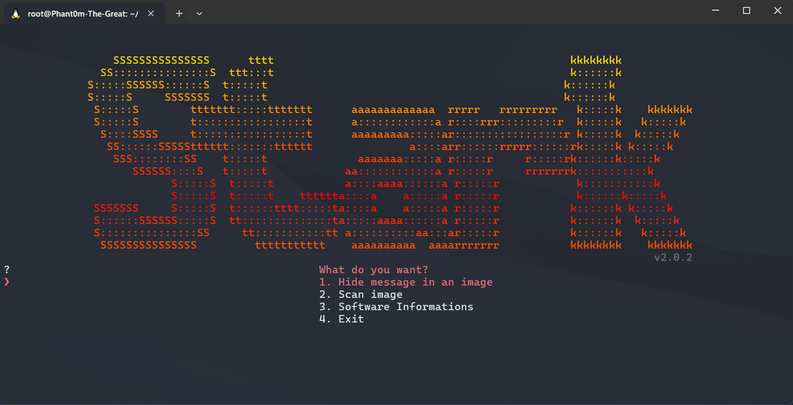
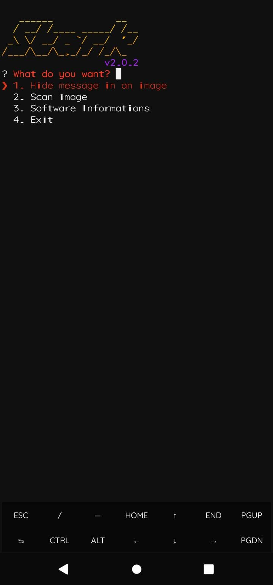

<h1 align="center">
    <a>Stark</a>
    
    
    
    
    
    

</h1>
<p align="center">Stark is a Python-based image steganography and analysis tool. A fast and efficient tool.</p>

## 📋 About
Stark is a CLI tool that uses metadata manipulation to hide your messages in PNG, JPG, JPEG and WEBP images. It can be used for encrypted communication, hiding confidential information, etc.

Furthermore, Stark can scan images (PNG, JPG, JPEG and WEBP), collecting EXIF ​​information, and other information such as image size, date and time of last modification, among other information.

## 👁‍🗨 In what situations could it be used?
You can use it for various purposes, such as hiding your passwords, secretly chatting with someone you know (using steganography as a means of encrypted communication), investigation, among others.
## 🧬 Tested on...
 - [x] **KALI LINUX 🐲**
 - [x] **TERMUX 📲**
 - [x] **UBUNTU 📀** 

## ⚙️ Installation + Use
> [!IMPORTANT]
> 📩
> For the installation to work, you must have "git" installed.
```
git clone https://github.com/Phant0mthegreat/Stark
```
```
cd Stark
```
```
bash install.sh
```
## 💉 Start in Kali and Termux
Use the command ↓
```
python3 Stark.py
```
To start the program whenever you want

## 💉 Start in Ubuntu
Use the command ↓ to start the python virtual environment
```
source stark_env/bin/activate
```
And use ↓ to start
```
python3 Stark.py
```
After use, the user ↓ to close the virtual environment
```
deactivate
```
