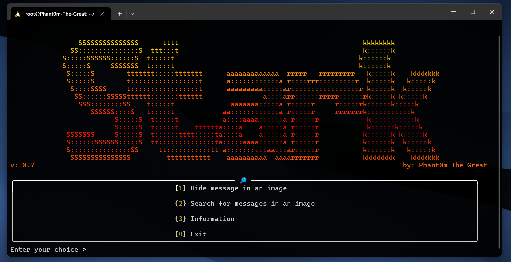
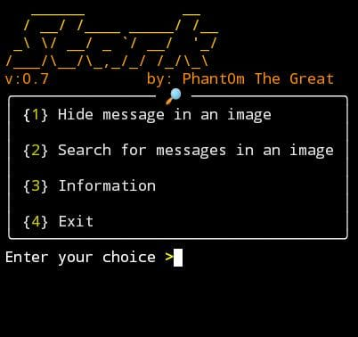

<h1 align="center">
    <a>Stark</a>
    
    
    
</h1>
<p align="center">Stark is an open source PNG, JPG and JPEG image steganography tool made in Python. A fast and efficient tool.</p>

## 📋 About
Stark is an open source tool made in Python that uses the metadata steganography method to hide your messages in PNG, JPG and JPEG images. It can be used for encrypted communication, hiding confidential information, etc.
Stark is widely used and you can use it for different purposes, such as hiding your passwords, for example, and even secretly chatting with someone you know.

## 👁‍🗨 What does Stark do?
Stark hides texts in images using the stogonography technique applied to image metadata, being compatible with PNG, JPG and JPEG images. It also comes with a function to check if there is a message in the image (identifies messages hidden by Stark himself)

## 🧬 Tested on...
 - [x] **KALI LINUX**
 - [x] **TERMUX** 

## ⚙️ Installation + Use
> [!IMPORTANT]
> 📩
> For the installation to work, you must have "git", the python language and "pip" installed.
```
git clone https://github.com/Phant0mthegreat/Stark
```
```
cd Stark
```
```
bash install.sh
```
## 💉 Start
Use the command ↓
```
python3 Stark.py
```
To start the program whenever you want
